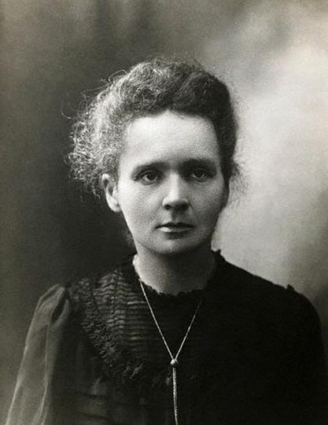
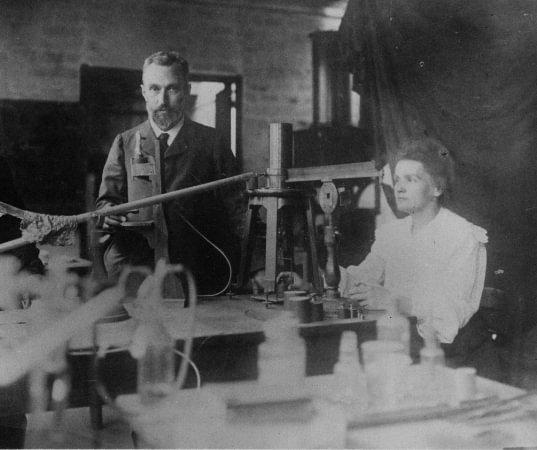

# Biographie

:::: {.section}

Marie Curie, née **Maria Skłodowska** le 7 novembre 1867 à Varsovie, est une scientifique connue pour ses recherches sur la radioactivité. Son parcours est exceptionnel, car elle a réussi à s’imposer dans le monde scientifique à une époque où les femmes avaient encore peu de place dans les études supérieures et la recherche.

::::

## Sommaire {#sommaire}

:::: {.section}

- [Enfance](#enfance)
- [Études](#etudes)
- [Rencontre avec Pierre Curie](#pierre-curie)
- [Travaux scientifiques](#travaux)
- [Prix Nobel](#prix-nobel)
- [Chronologie](#chronologie)

::::

## Enfance {#enfance}

:::: {.section}

Marie Curie grandit en Pologne dans une famille d’enseignants. Très jeune, elle montre un grand intérêt pour les études et les sciences. Son enfance est marquée par des difficultés familiales, notamment la mort de sa mère, mais aussi par le contexte politique difficile de la Pologne.

::::

## Études {#etudes}

:::: {.section}

En 1891, elle part à Paris pour poursuivre ses études à la Sorbonne. Elle y étudie la physique et les mathématiques. Malgré des conditions de vie difficiles, elle obtient ses diplômes et se consacre progressivement à la recherche scientifique.

::::

## Rencontre avec Pierre Curie {#pierre-curie}

:::: {.section}

Marie rencontre Pierre Curie, un scientifique français avec qui elle partage la même passion pour la recherche. Ils se marient en 1895 et travaillent ensemble sur des recherches importantes concernant la radioactivité.

::::

## Travaux scientifiques {#travaux}

:::: {.section}

Marie Curie étudie la radioactivité, un phénomène encore peu connu à son époque. Avec Pierre Curie, elle découvre deux nouveaux éléments chimiques :

- le polonium ;
- le radium.

Ces découvertes marquent une étape importante dans l’histoire de la physique et de la chimie.

::::

## Prix Nobel {#prix-nobel}

:::: {.section}

Marie Curie reçoit deux prix Nobel, ce qui fait d’elle une figure majeure de l’histoire des sciences.

| Année | Domaine | Avec qui | Motif |
|------:|---------|----------|-------|
| 1903 | Physique | Pierre Curie et Henri Becquerel | Travaux sur la radioactivité |
| 1911 | Chimie | Seule | Découverte du radium et du polonium |

::::

## Chronologie {#chronologie}

:::: {.section}

| Année | Événement | Description |
|------:|-----------|-------------|
| 1867 | Naissance | Naissance de Maria Skłodowska à Varsovie |
| 1891 | Études | Départ à Paris pour étudier à la Sorbonne |
| 1895 | Mariage | Mariage avec Pierre Curie |
| 1898 | Découvertes | Découverte du polonium et du radium |
| 1903 | Prix Nobel | Prix Nobel de physique |
| 1906 | Enseignement | Première femme professeure à la Sorbonne |
| 1911 | Deuxième Nobel | Prix Nobel de chimie |
| 1934 | Décès | Décès de Marie Curie |

::::
