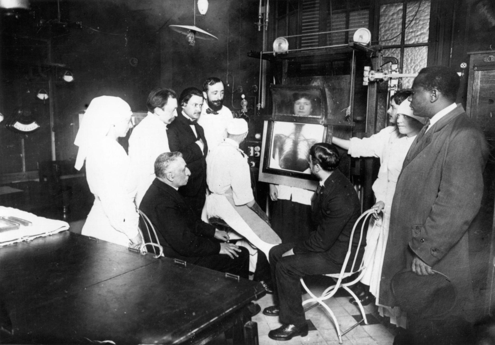

# Impact

:::: {.section}

Les travaux de Marie Curie ont eu un impact important dans plusieurs domaines. Ses recherches ont fait progresser la science, la médecine et ont aussi marqué la place des femmes dans le monde scientifique.

::::

## Sommaire {#sommaire}

:::: {.section}

- [Impact en médecine](#medecine)
- [Impact en science](#science)
- [Impact pendant la guerre](#guerre)
- [Place des femmes dans les sciences](#femmes)
- [Héritage](#heritage)

::::

## Impact en médecine {#medecine}

:::: {.section}

Les découvertes de Marie Curie ont contribué au développement de la radiologie et de la radiothérapie. Ces techniques sont utilisées pour observer l’intérieur du corps et pour traiter certaines maladies, notamment certains cancers.

Grâce à ses recherches sur le radium et la radioactivité, la médecine a pu développer de nouveaux moyens de diagnostic et de traitement.

::::

## Impact en science {#science}

:::: {.section}

Marie Curie a permis de mieux comprendre la matière et les propriétés de certains éléments chimiques. Ses travaux ont influencé la physique, la chimie et les recherches sur l’énergie atomique.

Elle a aussi montré l’importance de l’expérimentation scientifique et du travail rigoureux en laboratoire.

::::

## Impact pendant la guerre {#guerre}

:::: {.section}

Pendant la Première Guerre mondiale, Marie Curie participe à la mise en place d’unités mobiles de radiologie. Ces véhicules, parfois appelés les « petites Curies », permettaient de réaliser des examens radiologiques près du front.

Cela a aidé les médecins à localiser les blessures des soldats et à mieux les soigner.

::::

## Place des femmes dans les sciences {#femmes}

:::: {.section}

Marie Curie est devenue un symbole pour les femmes dans les sciences. À une époque où les femmes avaient peu accès aux études supérieures et aux carrières scientifiques, elle a réussi à s’imposer par son travail et ses découvertes.

Elle montre que les femmes peuvent jouer un rôle majeur dans la recherche scientifique.

::::

## Héritage {#heritage}

:::: {.section}

L’héritage de Marie Curie reste très important aujourd’hui.

- Elle est la première femme à recevoir un prix Nobel ;
- elle est la seule personne à avoir reçu deux prix Nobel dans deux domaines scientifiques différents ;
- elle a marqué l’histoire de la physique et de la chimie ;
- elle a contribué aux progrès de la médecine moderne.

| Domaine | Impact |
|---------|--------|
| Médecine | Développement de la radiologie et de la radiothérapie |
| Science | Meilleure compréhension de la radioactivité |
| Société | Modèle pour les femmes scientifiques |
| Histoire | Figure majeure des sciences modernes |

::::