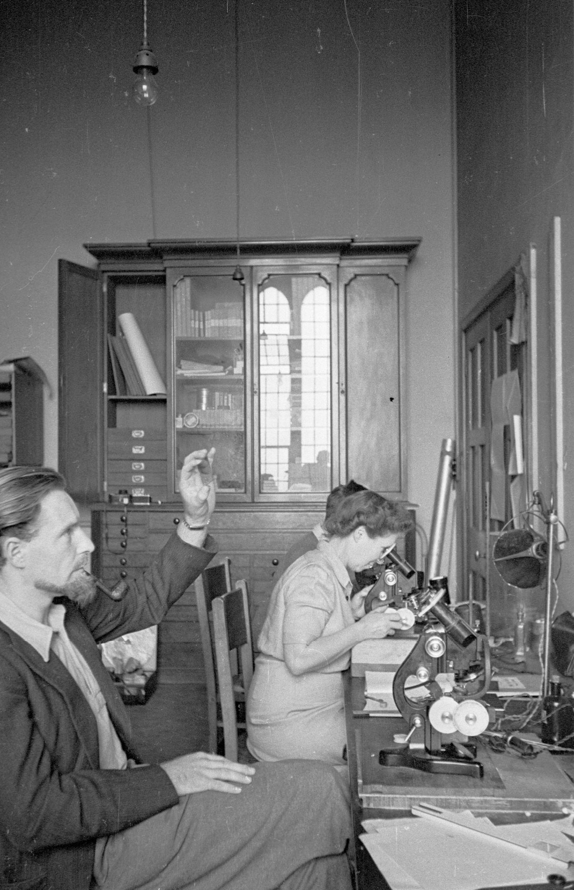

# Accueil

:::: {.section}

Bienvenue sur ce site consacré à **Marie Curie**, une scientifique majeure qui a profondément marqué l’histoire des sciences et des techniques.

Ce mini-site présente sa vie, ses découvertes scientifiques, ses travaux sur la radioactivité ainsi que son impact dans le monde médical et scientifique.

::::

## Sommaire {#sommaire}

:::: {.section}

- [Présentation du site](#presentation)
- [Objectif du site](#objectif)
- [Navigation](#navigation)

::::

## Présentation du site {#presentation}

:::: {.section}

Ce site est organisé en plusieurs pages :

- une page sur la biographie de Marie Curie ;
- une page sur ses travaux scientifiques ;
- une page sur son impact dans la société et la médecine ;
- une page recensant les sources utilisées.

::::

## Objectif du site {#objectif}

:::: {.section}

L’objectif de ce site est de comprendre pourquoi Marie Curie est une personnalité importante dans l’histoire des sciences.

Ses recherches ont permis de faire progresser la physique, la chimie et la médecine. Elle est aussi devenue un symbole pour la place des femmes dans les sciences.

::::

## Navigation {#navigation}

:::: {.section}

Pour découvrir le site, utilisez le menu situé à gauche. Il permet d’accéder aux différentes pages et à certaines sections importantes.

::::
