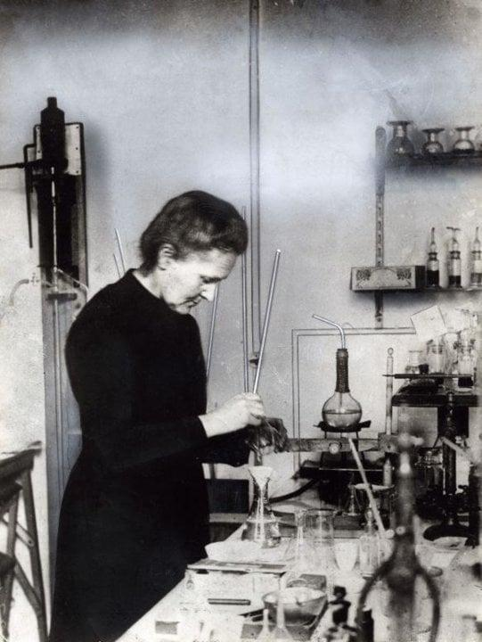

# Travaux scientifiques

:::: {.section}

Marie Curie est surtout connue pour ses recherches sur la **radioactivité**. Ses travaux ont marqué une étape importante dans l’histoire de la physique et de la chimie, car ils ont permis de mieux comprendre la structure de la matière.

::::

## Sommaire {#sommaire}

:::: {.section}

- [La radioactivité](#radioactivite)
- [Les découvertes](#decouvertes)
- [Le polonium](#polonium)
- [Le radium](#radium)
- [Les applications](#applications)
- [Tableau récapitulatif](#tableau)

::::

## La radioactivité {#radioactivite}

:::: {.section}

La radioactivité est un phénomène naturel par lequel certains éléments chimiques émettent de l’énergie sous forme de rayonnements. À l’époque de Marie Curie, ce phénomène était encore très peu connu.

Marie Curie a consacré une grande partie de sa vie à étudier ces rayonnements. Elle a montré que la radioactivité était une propriété propre à certains atomes.

::::

## Les découvertes {#decouvertes}

:::: {.section}

Avec Pierre Curie, Marie Curie découvre en 1898 deux nouveaux éléments chimiques :

- le **polonium** ;
- le **radium**.

Ces découvertes ont eu une grande importance scientifique, car elles ont ouvert de nouvelles pistes de recherche sur la matière et l’énergie.

::::

## Le polonium {#polonium}

:::: {.section}

Le polonium est nommé ainsi en hommage à la Pologne, le pays d’origine de Marie Curie. Cette découverte montre aussi l’attachement de la scientifique à ses origines.

::::

## Le radium {#radium}

:::: {.section}

Le radium est un élément fortement radioactif. Sa découverte a permis de développer de nouvelles recherches scientifiques et médicales, notamment dans le domaine du traitement de certaines maladies.

::::

## Les applications {#applications}

:::: {.section}

Les recherches de Marie Curie ont eu des applications importantes, surtout dans le domaine médical. Elles ont contribué au développement de la radiologie et de la radiothérapie.

Pendant la Première Guerre mondiale, Marie Curie participe aussi au développement d’unités mobiles de radiologie pour aider les médecins à localiser les blessures des soldats.

::::

## Tableau récapitulatif {#tableau}

:::: {.section}
Table: Découvertes principales de Marie Curie

| Élément | Année | Découvreurs | Importance |
|---------|------:|-------------|------------|
| Polonium | 1898 | Marie Curie et Pierre Curie | Nouvel élément nommé en hommage à la Pologne |
| Radium | 1898 | Marie Curie et Pierre Curie | Élément radioactif important pour la recherche et la médecine |

::::